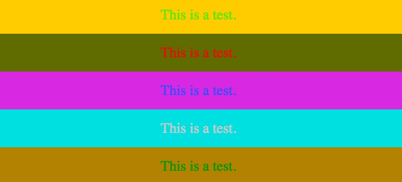
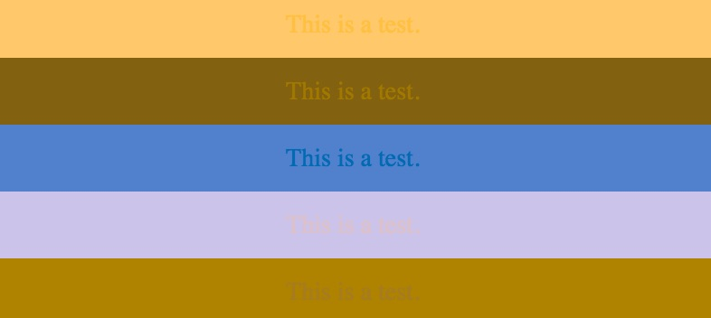
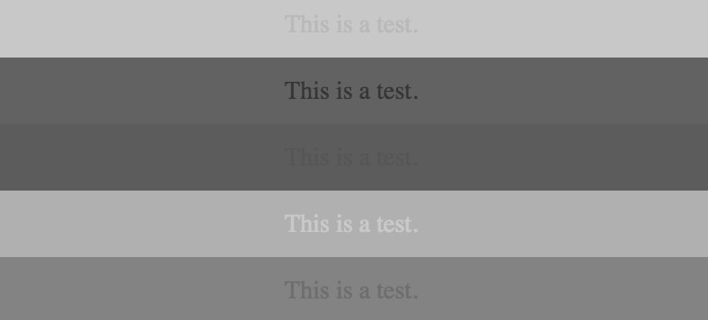

# PostCSS Colorblind Plugin

## Why?

The biggest reason is that as many developers don't have problems seeing color,
they never stop to consider that their (or their constituents') choices of
colors make their website unusable and frustrating to those who can't see some
shades of color. It's not even a small problem either; lots of people struggle
with red and green.

However, there are JavaScript bookmarklets that let you do this on the fly
without having to run a build step. I built this with the thought in mind you
could create an automated step to create a report of how you're doing
with color.

And lastly, building plugins for PostCSS is so damn easy and fun.

This plugin currently works for any place a CSS color is declared, whether it's
a named color (like `red` or `papayawhip`), hex, rgb, rgba, hsl or hsla. It
supports gradients and will also convert any linked images into color adjusted
embedded data.

## Install

```
npm install postcss-colorblind
```

## Setup

To make this module as effective as possible, make this the last module that
modifies your CSS.

```javascript
var fs = require("fs")
var postcss = require("postcss")
var colorblindPlugin = require("postcss-colorblind");

var css = fs.readFileSync("input.css", "utf8");

postcss()
  .use(colorblindPlugin({method:'achromatopsia'}))
  .process(css)
  .then(function(result) {
    fs.writeFileSync('output.css', result.css);
  });
```

## Parameters

### method _(default: deuteranopia)_

The module expects an object with a method name that it can give to the
[color-blind](https://github.com/skratchdot/color-blind) module. Thus, as of
writing, any of the following will work:

- `protanomaly`
- `protanopia`
- `deuteranomaly`
- `deuteranopia`
- `tritanomaly`
- `tritanopia`
- `achromatomaly`
- `achromatopsia`

## Color Blindness Table

Borrowed from @skratchdot's [color-blind](https://github.com/skratchdot/color-blind), the dependency of this module.

|                    Group                           |                                    |                             |                          |
|----------------------------------------------------|------------------------------------|-----------------------------|--------------------------|
| **Trichromat**<br/>*3 good cones*                  |Normal                              |                             |                          |
| **Anomalous Trichromat**<br/>*2 good cones, 1 bad* |Protanomaly<br/>*low red*           |Deuteranomaly<br/>*low green*|Tritanomaly<br/>*low blue*|
| **Dichromat**<br/>*2 good cones, 1 blind*          |Protanopia<br/>*no red*             |Deuteranopia<br/>*no green*  |Tritanopia <br/>*no blue* |
| **Monochromat**<br/>*1 good cone, 2 blind/bad*     |Achromatomaly<br />*almost no color*|Achromatopsia<br/>*no color* |                          |

## Examples

All colors, no filter:



Deuteranopia, no green:



Achromatopsia, no color:



## License

MIT

## Author

:heart: [Brian Holt](http://twitter.com/holtbt)
